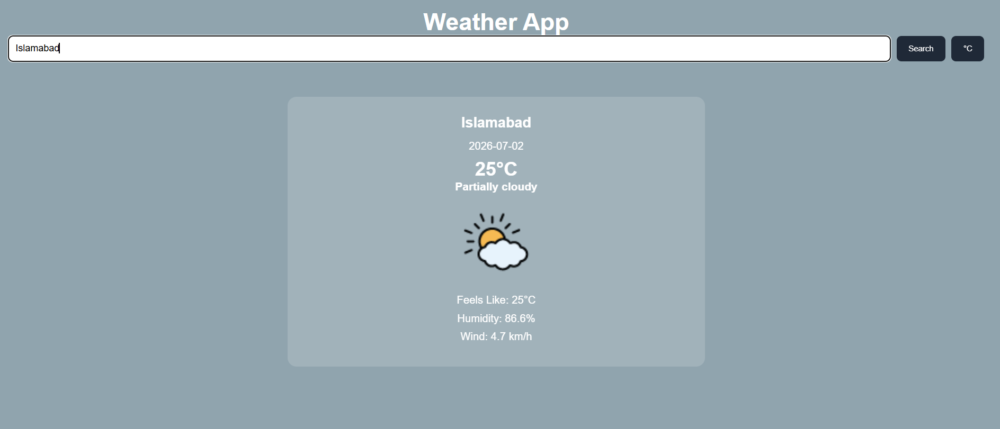

# 🌦️ Weather App

A modern weather application built with **JavaScript**, **Webpack**, and the **Visual Crossing Weather API**. Users can search for any city in the world and instantly view real-time weather information with a clean, responsive interface.

---

## 📖 Overview

This project was built as part of my JavaScript journey. It demonstrates working with external APIs, asynchronous JavaScript, modular application architecture, and dynamic DOM manipulation using ES6 modules.

---

## ✨ Features

- 🔍 Search weather by city name
- 🌡️ Toggle between Celsius and Fahrenheit
- ☁️ Display current weather conditions
- 💧 View humidity levels
- 🌬️ View wind speed
- 🌡️ Display "Feels Like" temperature
- 📅 Show current weather date
- 🎨 Dynamic background based on weather conditions
- ⏳ Loading state while fetching data
- ❌ Friendly error handling for invalid locations
- 📱 Fully responsive design

---

## 🛠️ Built With

- HTML5
- CSS3
- JavaScript (ES6+)
- Webpack
- npm
- Fetch API
- Async / Await
- Visual Crossing Weather API
- Git & GitHub

---

## 📂 Project Structure

```
weather-app/
│
├── dist/
│
├── src/
│   ├── api.js
│   ├── dom.js
│   ├── index.js
│   ├── style.css
│   ├── template.html
│   ├── ui.js
│   └── weather.js
│
├── package.json
├── webpack.config.js
├── .gitignore
└── README.md
```

---

## 🚀 Installation

Clone the repository

```bash
git clone https://github.com/salman61101/weather-app.git
```

Move into the project folder

```bash
cd weather-app
```

Install dependencies

```bash
npm install
```

Start the development server

```bash
npm start
```

Build the production version

```bash
npm run build
```

---

## 🌐 Live Demo

**GitHub Pages**

https://salman61101.github.io/weather-app/

---

## 📸 Screenshot
## 📸 Screenshot



## 🎯 Learning Outcomes

This project helped strengthen my understanding of:

- JavaScript Modules (ES6)
- Webpack
- npm
- Asynchronous JavaScript
- Promises
- Async / Await
- Fetch API
- REST APIs
- JSON Processing
- Error Handling
- Dynamic DOM Manipulation
- Responsive UI Design
- Git Workflow
- GitHub Pages Deployment

---

## 📚 Future Improvements

- 7-Day Weather Forecast
- Hourly Forecast
- Search History
- Geolocation Support
- Weather Icons Library
- Dark / Light Theme
- Better Weather Animations
- Recent Searches
- Save Favorite Cities

---

## 👨‍💻 Author

**Salman**

GitHub:
https://github.com/salman61101

---

## 🙏 Acknowledgements

- The Odin Project
- Visual Crossing Weather API
- MDN Web Docs

---

## 📄 License

This project is licensed under the MIT License.